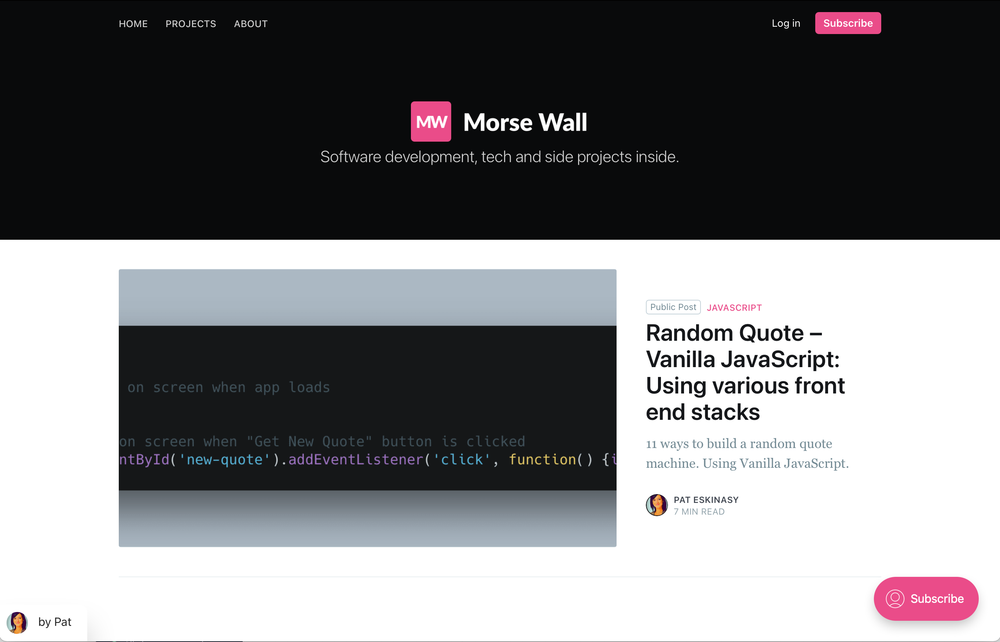

# Building a random quote machine using 11 different front end stacks

This is one the the 11 flavors in which this random quote machine is being built.

If you’re curious about the other flavors and would like to make a writer very happy today, you should [subscribe to Morse Wall](https://www.morsewall.com/signup).

## Contributing

Found a typo in the documentation or interested in fixing a bug? Then by all means [submit an issue](https://github.com/morsewall/random-quote-vanillajs-array/issues/new) or [pull request](https://help.github.com/articles/using-pull-requests/). If this is your first pull request, it may be helpful to read up on the [GitHub Flow](https://guides.github.com/introduction/flow/) first.

## Credits

### Creator

**Pat Eskinasy**
* [https://www.eskinasy.com](https://www.eskinasy.com/)
* [https://www.morsewall.com/](https://www.morsewall.com/)
* [https://twitter.com/celue](https://twitter.com/celue)

## License

The MIT License (MIT)

Copyright (c) 2019 Pat Eskinasy

Permission is hereby granted, free of charge, to any person obtaining a copy
of this software and associated documentation files (the "Software"), to deal
in the Software without restriction, including without limitation the rights
to use, copy, modify, merge, publish, distribute, sublicense, and/or sell
copies of the Software, and to permit persons to whom the Software is
furnished to do so, subject to the following conditions:

The above copyright notice and this permission notice shall be included in all
copies or substantial portions of the Software.

THE SOFTWARE IS PROVIDED "AS IS", WITHOUT WARRANTY OF ANY KIND, EXPRESS OR
IMPLIED, INCLUDING BUT NOT LIMITED TO THE WARRANTIES OF MERCHANTABILITY,
FITNESS FOR A PARTICULAR PURPOSE AND NONINFRINGEMENT. IN NO EVENT SHALL THE
AUTHORS OR COPYRIGHT HOLDERS BE LIABLE FOR ANY CLAIM, DAMAGES OR OTHER
LIABILITY, WHETHER IN AN ACTION OF CONTRACT, TORT OR OTHERWISE, ARISING FROM,
OUT OF OR IN CONNECTION WITH THE SOFTWARE OR THE USE OR OTHER DEALINGS IN THE
SOFTWARE.
